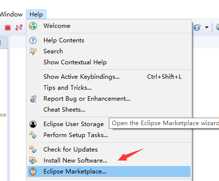
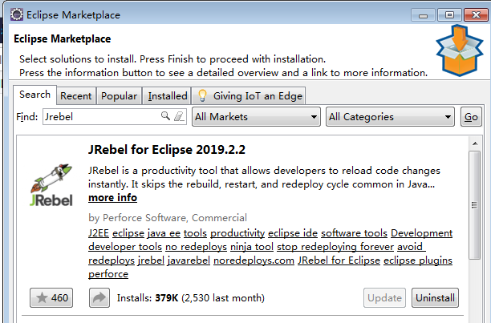
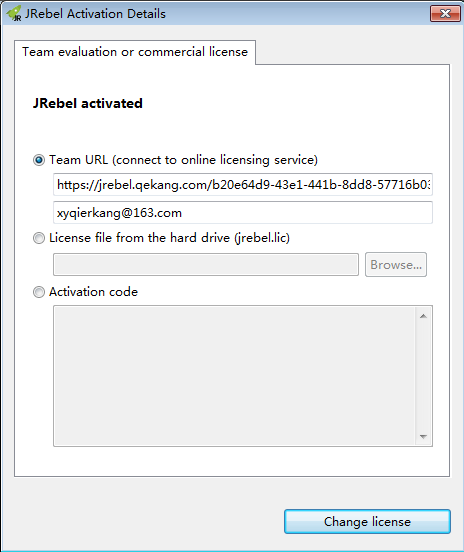
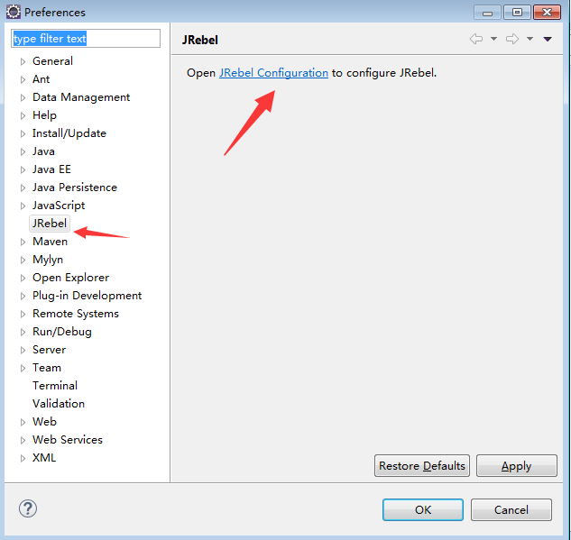
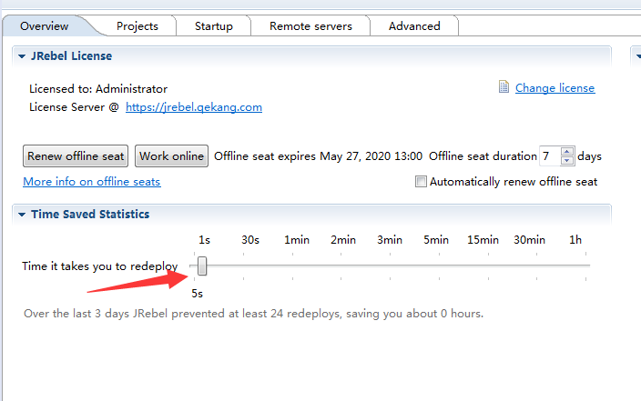
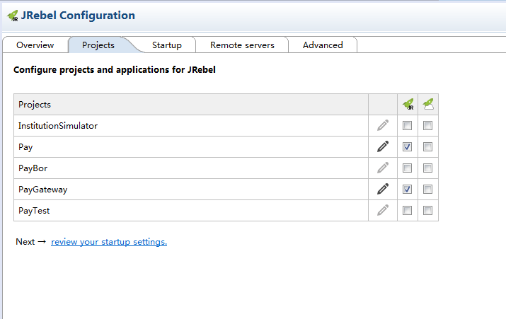
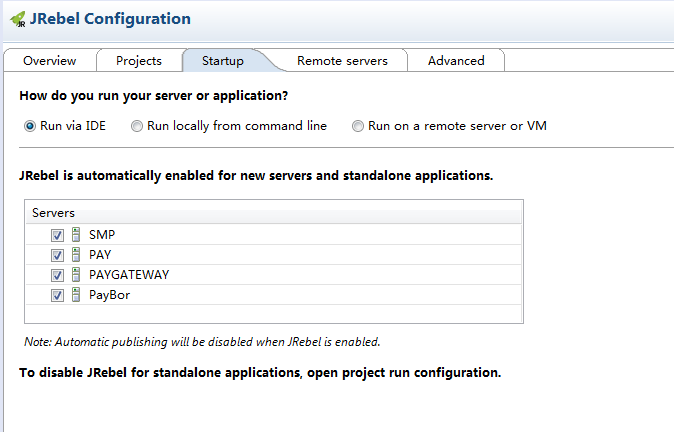
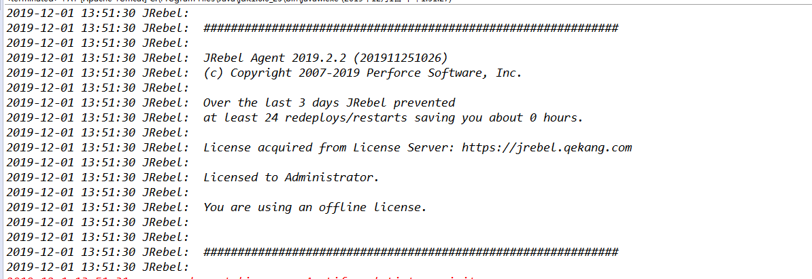
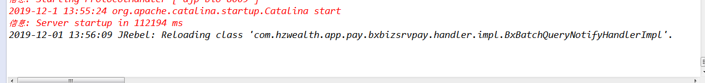

 作为一名程序猿，在写程序的时候，总是不能一气呵成的写出无bug的代码，就算是噼里啪啦的一顿敲，可能会出现10行代码9个bug，这时候咋办啊，有bug就改吧。于是就心平气和的一步一步的debug，运气好的好，能一眼看出问题的所在，直接命中目标，三两下改好了，重新编译，部署到服务器，正在欣喜之中，又发现一个bug，于是耐着心思看了一眼代码，没有发现bug，于是冷静了一下，开始调试，发现问题所在，稍微改动一下，又重新编译部署到服务器，经过漫长的等待，发现bug还在，又改了一下，重新编译部署到服务器，经过漫长的等待，bug依然在。这可咋办，改一行代码参数3秒，服务启动1分钟。来来回回半个小时过去了，这可咋办，于是JRebel就出现了。
 
**JRebel是一款十分方便的插件，在Java Web项目中，我们一般修改了java代码后需要重启tomcat才能生效，而Jrebel支持热部署，也就是说不用重新启动Tomcat，修改的代码同样可以生效不必每次都等待服务器（如tomcat）的启动，当即修改当即生效，能够节省大批的时间，提高了个人开发效率。**

### 在Eclipse中安装JRebel

1.打开eclipse，help -> Eclipse Marketplace

2.搜索Jrebel 安装并重启，这里我已经安装过了 

3.重启后在 Help -> Jrebel -> Activation 激活

4.这里有三种方式可以选择，具体激活方法可自行百度。激活之后重启。

### JRebel项目配置

1.打开eclipse，Window->Preferrences->JRebel。或者
点击菜单“Help->JRebel Configuration”进入JReble配置中心

2.设置JRebel重加载时间，本人设置为5秒

3.选择project，将项目添加到Jrebel中，项目后面有两个绿色图标，在第一个打勾即可

4.选择一个WEB服务器，开启JRebel支持

5.启动自动编译：eclipse选择菜单Projecy->Build Automatically打钩。启动Tomcat，输出下面2句话表示JRebel启动。

6.尝试修改Java 代码，会发现控制台输出热部署信息

